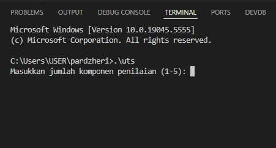
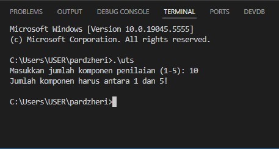
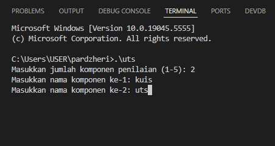
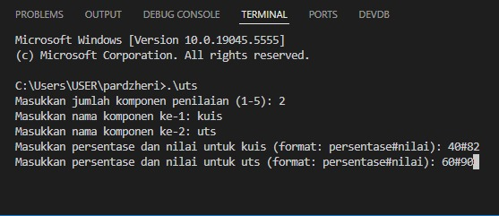
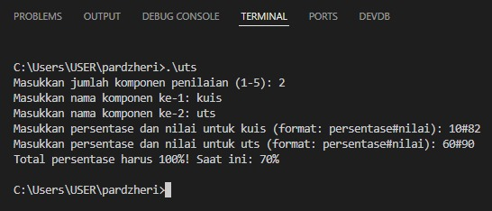
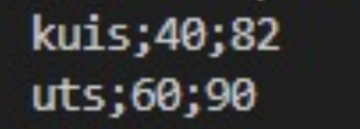
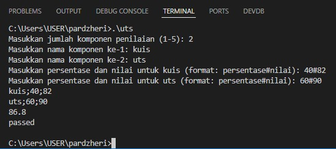

# Kalkulator Nilai Akhir Mata Kuliah

Program ini bertujuan untuk membantu mahasiswa menghitung nilai akhir suatu mata kuliah berdasarkan berbagai komponen penilaian yang memiliki bobot berbeda. Program akan meminta input dari pengguna mengenai jumlah komponen, nama komponen, serta persentase bobot dan nilai yang diperoleh.

# Alur Kerja Program
1. Pengguna akan memasukkan jumlah komponen yang ingin dihitung (minimal 1, maksimal 5).
   

2. Jika jumlah yang dimasukkan di luar batas, program akan memberikan peringatan dan berhenti.
   

3. Program akan meminta pengguna untuk memasukkan nama setiap komponen satu per satu.
   Contoh komponen: Quiz, Assignment, Mid Exam, Final Exam, Seminar Proposal, dll.
   (note: Komponen penilaian dikemas dalam structure)
   

5. Setelah nama komponen dimasukkan, program akan meminta pengguna memasukkan persentase bobot dan nilai yang diperoleh dalam format: 
   persentase#nilai
   

6. Bobot adalah persentase kontribusi komponen terhadap nilai akhir (total bobot harus 100%).

7. Nilai yang diperoleh adalah skor yang mahasiswa dapatkan untuk komponen tersebut (rentang 0 - 100).

8. Jika total bobot kurang atau lebih dari 100%, program akan menampilkan pesan error dan berhenti.
   

9. Program akan mencetak semua komponen yang telah dimasukkan dalam format:
   <Nama Komponen>;<Persentase Bobot>;<Nilai>
   

10. Selanjutnya, Jika nilai akhir ≥ 50.0, maka program mencetak "passed". Jika nilai akhir < 50.0, maka program mencetak "failed".
   

11. Buatlah program dengan mengimplementasikan seluruh materi yang telah di pelajari, mulai dari variabel dan tipe data, brancing dan repetition, array dan memory allocation, operasi string, enum dan struct. Semakin banyak anda mengimplementasikan materi-materi diatas maka akan semakin besar poin yang anda dapat.

SELAMAT BEKERJA.
